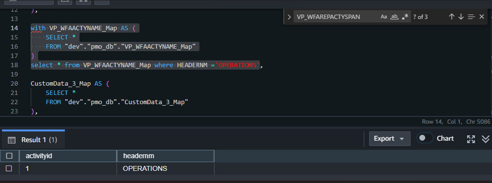
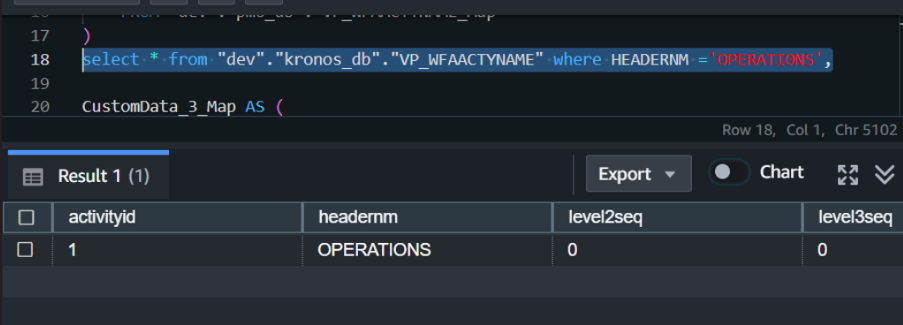

# Changed Business Logic:

## Project Management Dashboard >> Datamart

### 🚩$tab Ref Tables

#### DatetoPPE:
``` sql
Mapping
LOAD Date, 
     date(PPE,'YYYY-MM-DD') as [PPE Date]
FROM
[lib://Data Warehouse/All/data/Pay Periods.qvd] (qvd)
where Date <= Today()
```
The loaded pay_periods table in the `redshift` does not have a column named `Date` Instead we used `adjustedapplydate`

	Note📝:
This have an effect on a downstream usage of that column, There is a `qliksense table:` KronosActivities_Final that we're buiding in the Curated dataset has another business Logic change involing this same column i.e
``` sql
num(num#(PERSONNUM,'#'))&'|'&  ApplyMap('DatetoPPE',EVENTDTM,null()) as Key4 , //used to link to Labor Distribution
```
Since 'DatetoPPE' does not have `EVENTDTM` column we are using `adjustedapplydate` for the Applymap migration,
Here is the Shif & Lift Qliksense Migration Logic to Redshift Logic:
``` sql 
        CAST(vp.PERSONNUM || '|' || COALESCE(
            (
                SELECT adjustedapplydate
                FROM DatetoPPE
                WHERE DatetoPPE.adjustedapplydate = vp.EVENTDTM
            ),
            NULL
        ) AS VARCHAR) AS Key4,
```

### 🚩$tab KronosActivities
``` sql
`Applymap('VP_WFAACTYNAME_Map',ACTIVITYID,'NoHeaderName') as Activity,`
```
ACTIVITYID is an Interger with just Ids
The Applymap should have be facing `HEADERNM` Since it's value 'OPERATIONS' where the script is consuming downstream 
``` sql

IF(Activity='OPERATIONS', 1,0) as OpsHours_Flag,
if(NOT Activity='OPERATIONS'  and Not Match(Left(Activity,2),'PM','IS') AND Match(ActivityPhase,'Configuration', 'Test','Testing' ,'Implementation',''), 1, 0) as CapitalHours_Flag,
If(ACTIVITYID=1,0,if(NOT Activity='OPERATIONS' AND (Match(Left(Activity,2),'PM','IS') OR Match(ActivityPhase,'Planning','Post-Implementation','Preliminary')), 1, 0)) as NonCapitalHours_Flag,
If(Activity='OPERATIONS','Operations',
	 (if(Not Match(Left(Activity,2),'PM','IS') AND Match(ActivityPhase,'Configuration', 'Test','Testing' ,'Implementation',''), 'Capitalizable',
	 IF (ACTIVITYID=1,0,if(NOT Activity='OPERATIONS' AND (Match(Left(Activity,2),'PM','IS') OR Match(ActivityPhase,'Planning','Post-Implementation','Preliminary','')), 'Non-Capitalizable', 'Undefined')) ))) as CapitalizationType;

```

    NOTE:
There is Only one Occurance of 'OPERATIONS' in the model


Here is The Source Where we Only Have one Occurance as well

